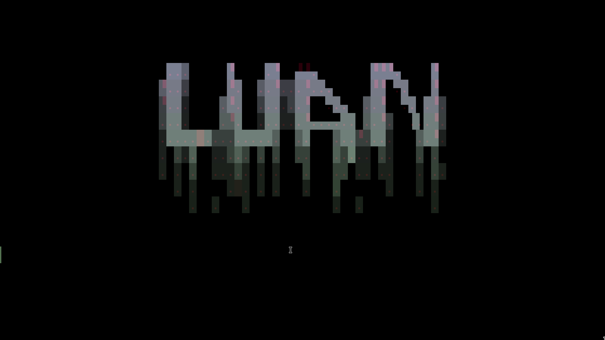
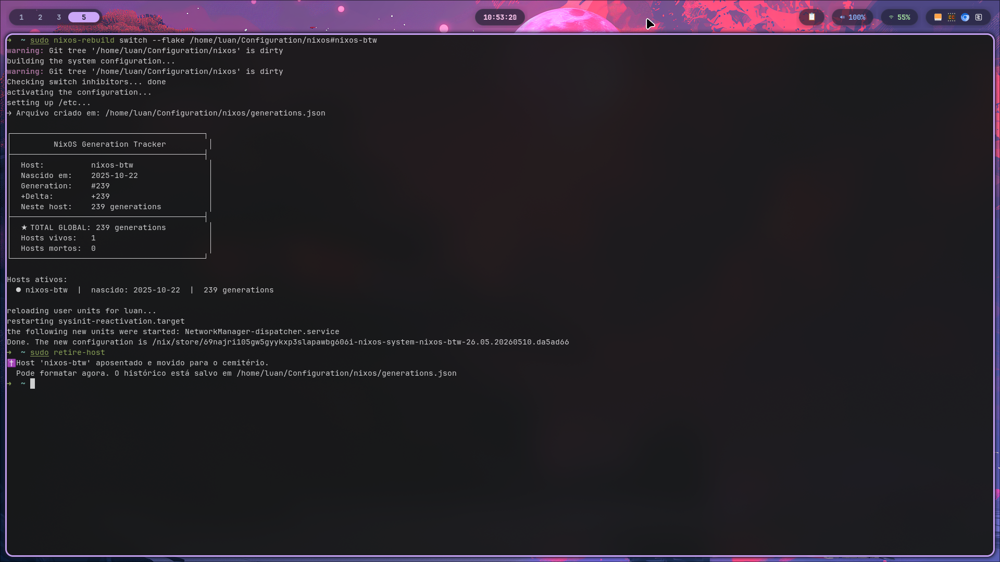
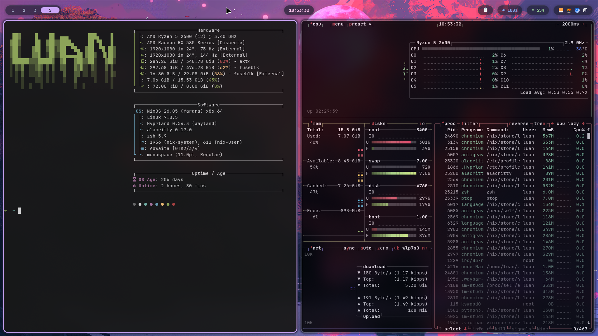
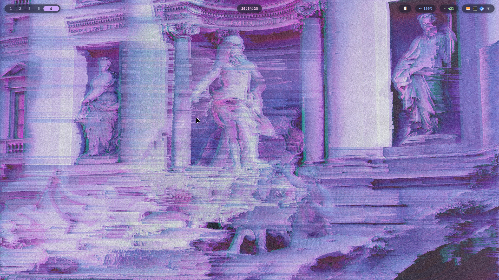

Configuration for my personal system, utilizing hyprland, waybar, micromamba, vicinae, fastfetch.

# System Overview

This document provides a detailed explanation of the NixOS configuration, including system architecture, visual aesthetics, and unique custom features.

## System Architecture

- **OS:** [NixOS](https://nixos.org/), configured declaratively using Flakes.
- **Hosts:** 
  - `nixos-btw` (Desktop profile)
  - `arrow` (Laptop profile, optimized with brightness/battery management)
- **Window Manager:** [Hyprland](https://hyprland.org/), a dynamic tiling Wayland compositor.
- **Environment Management:** [Home Manager](https://github.com/nix-community/home-manager) handles user-specific configurations and dotfiles.

## Visual Aesthetics & Colors

The system employs a **"Frosted Glass"** and **"Pills"** aesthetic design, giving the interface a translucent, blurred, and floating appearance. 

- **Global Theme:** 
  - GTK and Qt are configured to enforce a uniform dark theme (`adwaita-dark`).
  - Cursor theme: `Bibata-Modern-Classic`.
- **Waybar Color Palette:**
  Inspired by the Catppuccin palette, modules utilize specific accent colors to create a cohesive yet distinct look:
  - **Clock:** Pink (`#f5c2e7`)
  - **Audio:** Blue (`#89b4fa`)
  - **Network:** Green (`#a6e3a1`)
  - **Battery:** Peach (`#fab387`) / Green (Charging) / Red (Warning - blinking)
  - **Media (MPRIS):** Mauve (`#cba6f7`)
  - **Workspaces:** Active workspaces highlight in Mauve (`#cba6f7`) and transition smoothly.

## Unique Customizations & Functions

The environment is heavily customized to maximize productivity and visual appeal through custom scripts and targeted tool choices.

### Custom Scripts & Utilities
A dedicated `~/.local/bin/` folder houses several unique shell scripts:
- `screenshot.sh`: For capturing screens and regions.
- `wallpaper.sh`: For handling wallpaper changes dynamically.
- `battery-alert.sh`: Alerts the user when the battery is running critically low.

### The Screensaver System
Instead of a traditional lock screen loop, the system utilizes a custom **Terminal Screensaver**:
- Powered by `hypridle` detecting inactivity.
- Runs an Alacritty instance executing `term-saver.sh` via the `run-screensaver.sh` wrapper.
- Automatically handles brightness dimming (especially on the `arrow` host) before transitioning to `hyprlock` or system suspension.

### Shell & Terminal
- **Terminal Emulator:** Alacritty.
- **Shell:** Zsh powered by `oh-my-zsh` with the `robbyrussell` theme, syntax highlighting, and autosuggestions.
- **Fetch:** `fastfetch` runs automatically on new terminal sessions to display system info.

### Workflow Enhancements
- **Waybar:** Configured with floating "pill" shaped modules.
- **Clipboard Management:** Integrated `cliphist` with `wofi`, accessible directly through a custom Waybar module (📋).
- **Automounting:** `udiskie` handles seamless USB/drive mounting with tray integration.
- **Git:** User credentials and settings securely injected via Home Manager.

## System Showcase

The following screenshots illustrate the current state of the system, showcasing the "Frosted Glass" and "Pills" aesthetic, the custom Waybar configuration, and the dynamic tiling layout of Hyprland.

